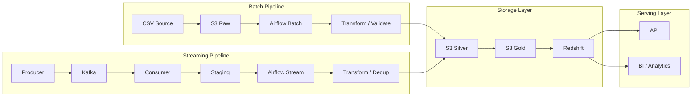

# 🛠 Airflow Data Pipeline Orchestration

---

## 📌 Summary

This project implements a **production-style data pipeline orchestration system** using Apache Airflow.

It focuses on:

* integrating streaming (Kafka) and batch pipelines
* ensuring data correctness via downstream deduplication
* orchestrating ETL workflows across multiple layers
* transforming raw events into analytics-ready datasets

👉 Designed to simulate a **real-world data platform orchestration layer connecting batch, streaming, and serving systems**

---

## 🔗 Integration with Data Platform

This project sits at the **center of the data platform**:

- Project 1 → batch ETL and data modeling (analytics-ready datasets)
- Project 2 → API serving layer for data consumption
- Project 3 → real-time streaming ingestion (Kafka)
- Project 4 → orchestration, transformation, and deduplication (this project)
- Project 5 → cloud storage and warehouse (S3 / Redshift / Athena)

👉 Airflow acts as the **central orchestration layer connecting all components**

---

## 🔄 Data Flow

Kafka → Staging → Airflow → Transform / Dedup → S3 Silver/Gold → Redshift / Athena → API / BI

---

## 🏗 Architecture Overview

👉 Batch + Streaming pipelines are unified into a single data model

---

## ⚙️ Pipeline Flow

### 1️⃣ Extract (Staging Layer)
- Airflow reads streaming output from Kafka staging (JSONL / S3)
- Batch data is ingested from raw layer
- Schema is validated and normalized

### 2️⃣ Transform (Processing Layer)
- Airflow executes modular DAG tasks
- Data is cleaned and validated
- Deduplication is applied (downstream of Kafka at-least-once delivery)
- Business logic and aggregations are applied

### 3️⃣ Load (Storage & Serving Layer)
- Cleaned data is written to S3 Silver layer
- Aggregated data is promoted to S3 Gold layer
- Final datasets are loaded into Redshift for analytics

---

## 🧩 DAG Structure

This project contains multiple Airflow DAGs for different orchestration use cases:

- `project1_etl_runner.py` → orchestrates the original batch ETL workflow
- `sales_etl_pipeline.py` → runs sales ETL processing tasks
- `streaming_staging_pipeline.py` → processes Kafka staging data with downstream transformation and deduplication
- `redshift_mart_pipeline.py` → builds / updates Redshift mart tables for analytics

👉 These DAGs show that Airflow is used as a central orchestration layer, not just a single-task scheduler.

---

## 🔁 Deduplication Strategy

This system follows an **at-least-once delivery model**:

- Kafka ensures no data loss
- Duplicate events may occur due to reprocessing or consumer retries

### Design Decision

Deduplication is intentionally handled **downstream in Airflow**, not in the consumer layer.

👉 Reason:

- Avoids data loss in case of consumer failure
- Keeps the streaming layer lightweight and stateless
- Ensures correctness is enforced in a controlled batch processing environment

### Approach

- Use `event_id` as a unique identifier
- Deduplicate records during transformation (Airflow DAG)

### Guarantees

- No data loss (streaming ingestion layer)
- Data correctness (processing / warehouse layer)

👉 This reflects a real-world trade-off:  
**reliability first → correctness enforced downstream**

---

## ⚡ Scalability Design

- Airflow breaks workflows into modular DAG tasks, enabling parallel execution  
- Batch and streaming pipelines scale independently without coupling  
- S3 acts as a decoupled storage layer (compute vs storage separation)  
- Redshift scales analytical workloads independently from ingestion  

👉 This architecture supports **horizontal scaling across ingestion, processing, and serving layers**

---

## 🚨 Reliability & Failure Handling

- Kafka ensures **at-least-once delivery** (no data loss)  
- Airflow retries failed tasks and manages execution dependencies  
- Deduplication is handled downstream to resolve duplicate events from streaming ingestion  
- Data can be rebuilt from raw → silver → gold layers  

👉 This design prioritizes **reliability first, correctness enforced downstream**

---

## 📸 Execution Proof

### Airflow DAG

### Task Logs

### Streaming Alert

### S3 Output

---

## 🧠 What This Project Demonstrates

This project demonstrates the design of a **production-style data orchestration system**:

- Orchestrating multi-layer data pipelines using Airflow  
- Integrating streaming (Kafka) and batch processing workflows  
- Handling at-least-once ingestion with downstream deduplication  
- Building a unified data pipeline across data lake and warehouse layers  

👉 More importantly, it reflects **system-level thinking in real-world data platforms**

---

## 💡 Key Takeaway

This project demonstrates how to design a **real-world data orchestration system**:

- Airflow as a central orchestration layer  
- Decoupled ingestion, processing, and storage layers  
- Reliability-first architecture with downstream data correction  
- End-to-end transformation into analytics-ready datasets  

👉 Not just orchestration — but a **complete, scalable data platform design**
