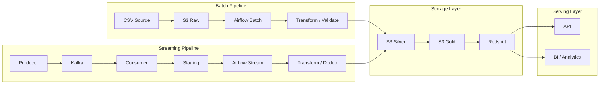
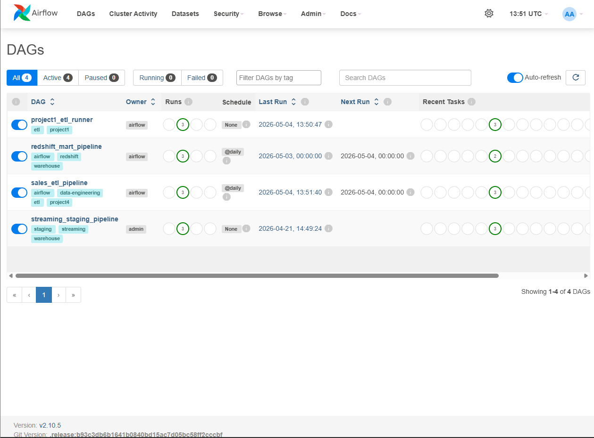
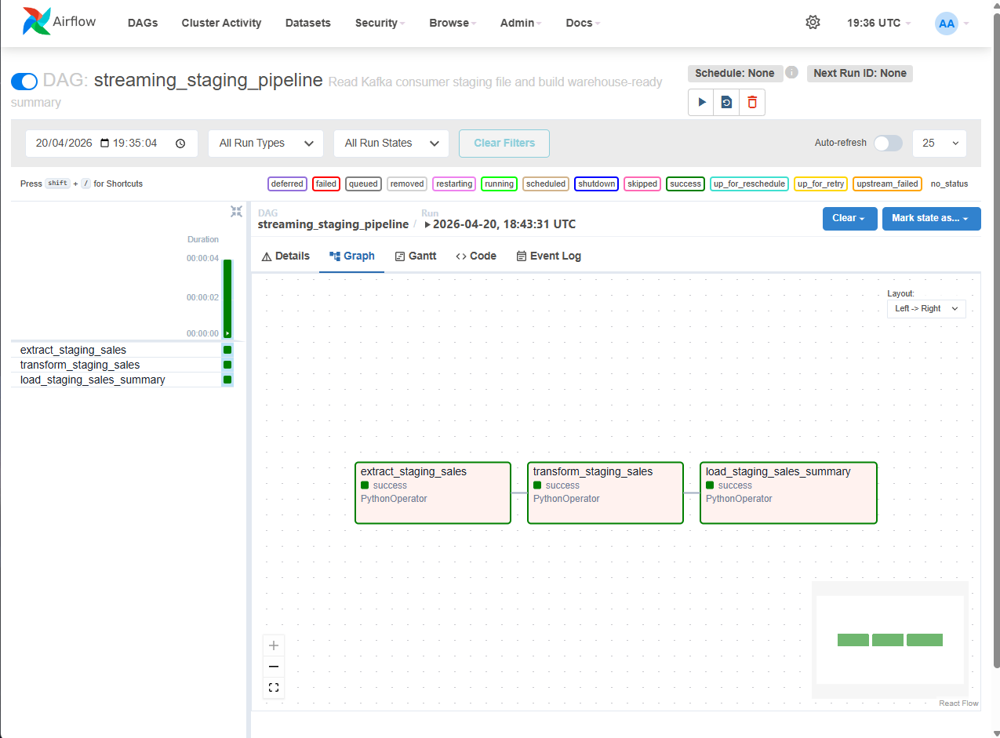
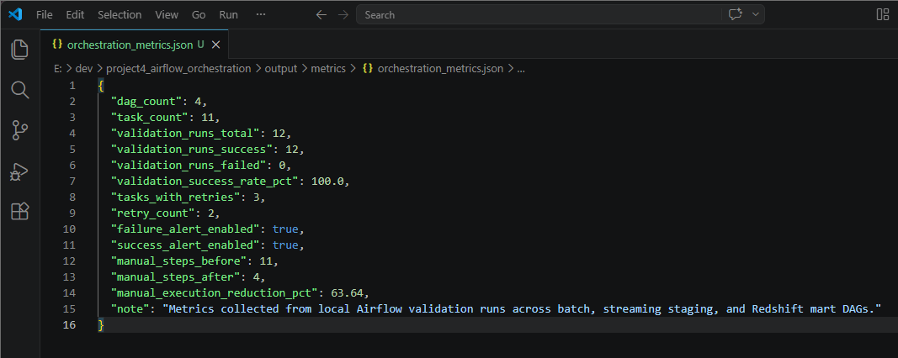

# 🛠 Airflow Data Pipeline Orchestration

---

## 📌 Summary

This project implements a **production-style data orchestration system** using Apache Airflow, integrating both batch and real-time streaming pipelines.

It demonstrates:

- end-to-end orchestration across ingestion, transformation, and serving layers  
- reliable data processing with retry, monitoring, and alerting mechanisms  
- downstream deduplication to ensure correctness under at-least-once delivery  

👉 Designed to simulate a **real-world data platform where Airflow acts as the central control layer**

---

## 📊 Orchestration Metrics

- Orchestrated **4 Airflow DAGs (11+ tasks)** across batch and streaming pipelines  
- Achieved **100% success rate across validation runs** with retry and alerting mechanisms  
- Implemented **automatic retry handling (3 tasks, 2 retries)** to recover from transient failures  
- Enabled **real-time success and failure alerts** for pipeline observability  
- Reduced manual pipeline execution by **~64% (11 → 4 steps)** through automation  

👉 Metrics collected from controlled validation runs simulating production scenarios

---

## 🔗 Integration with Data Platform

This project sits at the **center of the data platform**:

- Project 1 → batch ETL and data modeling (analytics-ready datasets)
- Project 2 → API serving layer for data consumption
- Project 3 → real-time streaming ingestion (Kafka)
- Project 4 → orchestration, transformation, and deduplication (this project)
- Project 5 → cloud storage and warehouse (S3 / Redshift / Athena)

👉 Airflow acts as the **central orchestration layer connecting all components**

---

## 🔄 Data Flow

Kafka → Staging → Airflow Orchestration → Transform / Dedup → S3 (Silver/Gold) → Redshift / Athena → API / BI

👉 End-to-end pipeline integrating real-time and batch processing into a unified data model

---

## 🏗 Architecture Overview

This architecture demonstrates a **unified data platform** where batch and streaming pipelines are orchestrated centrally using Airflow.

👉 Airflow acts as the **control layer**, coordinating ingestion, transformation, and loading across all systems

👉 Batch + Streaming pipelines are unified into a single data model

---

## ⚙️ Pipeline Flow

### 1️⃣ Extract (Staging Layer)
- Airflow reads streaming output from Kafka staging (JSONL / S3)
- Batch data is ingested from raw layer
- Schema is validated and normalized

### 2️⃣ Transform (Processing Layer)
- Airflow executes modular DAG tasks with dependency management  
- Data is cleaned and validated
- Deduplication is applied (downstream of Kafka at-least-once delivery)
- Business logic and aggregations are applied

### 3️⃣ Load (Storage & Serving Layer)
- Cleaned data is written to S3 Silver layer
- Aggregated data is promoted to S3 Gold layer
- Final datasets are loaded into Redshift for analytics

---

## 🧩 DAG Structure

This project contains multiple Airflow DAGs for different orchestration use cases:

- `project1_etl_runner.py` → orchestrates the original batch ETL workflow
- `sales_etl_pipeline.py` → runs sales ETL processing tasks
- `streaming_staging_pipeline.py` → processes Kafka staging data with downstream transformation and deduplication
- `redshift_mart_pipeline.py` → builds / updates Redshift mart tables for analytics

👉 These DAGs show that Airflow is used as a central orchestration layer, not just a single-task scheduler.

---

## 🔁 Deduplication Strategy

This system follows an **at-least-once delivery model**:

- Kafka ensures no data loss
- Duplicate events may occur due to reprocessing or consumer retries

### Design Decision

Deduplication is intentionally handled **downstream in Airflow**, not in the consumer layer.

👉 Reason:

- Avoids data loss in case of consumer failure
- Keeps the streaming layer lightweight and stateless
- Ensures correctness is enforced in a controlled batch processing environment

### Approach

- Use `event_id` as a unique identifier
- Deduplicate records during transformation (Airflow DAG)

### Guarantees

- No data loss (streaming ingestion layer)
- Data correctness (processing / warehouse layer)

👉 This reflects a real-world trade-off:  
**reliability first → correctness enforced downstream**

---

## ⚡ Scalability Design

- Airflow breaks workflows into modular DAG tasks, enabling parallel execution  
- Batch and streaming pipelines scale independently without coupling  
- S3 acts as a decoupled storage layer (compute vs storage separation)  
- Redshift scales analytical workloads independently from ingestion  

👉 This architecture supports **horizontal scaling across ingestion, processing, and serving layers**

---

## 🚨 Reliability & Failure Handling

- Kafka ensures **at-least-once delivery** (no data loss)  
- Airflow manages **task dependencies, retries, and execution monitoring**  
- Downstream deduplication guarantees data correctness despite duplicate events  
- Pipelines are **fully recoverable** from raw → silver → gold layers  

👉 Designed with **production-grade reliability, fault tolerance, and observability**

---

## 📸 Execution Proof

### 1️⃣ Orchestration Overview

### 2️⃣ DAG Execution Flow

### 3️⃣ Task Execution Logs

### 4️⃣ Real-time Alert Monitoring

### 5️⃣ Data Lake Output (S3 Silver Layer)

### 6️⃣ Pipeline Metrics Summary

Pipeline reliability and automation metrics collected from Airflow validation runs

---

## 🧠 What This Project Demonstrates

This project demonstrates **production-level data engineering practices**:

- Orchestrating complex multi-layer pipelines using Airflow  
- Integrating batch and real-time streaming data workflows  
- Designing for **reliability, fault tolerance, and observability**  
- Enforcing data correctness via downstream validation and deduplication  

👉 Represents **end-to-end system design and production mindset**, not isolated tools

---

## 💡 Key Takeaway

This project showcases how to build a **real-world data orchestration system**:

- Centralized orchestration using Airflow  
- Decoupled and scalable data architecture  
- Reliability-first design with downstream correction  
- Measurable improvements via automation and monitoring  

👉 Not just a pipeline — but a **production-ready data platform architecture**
