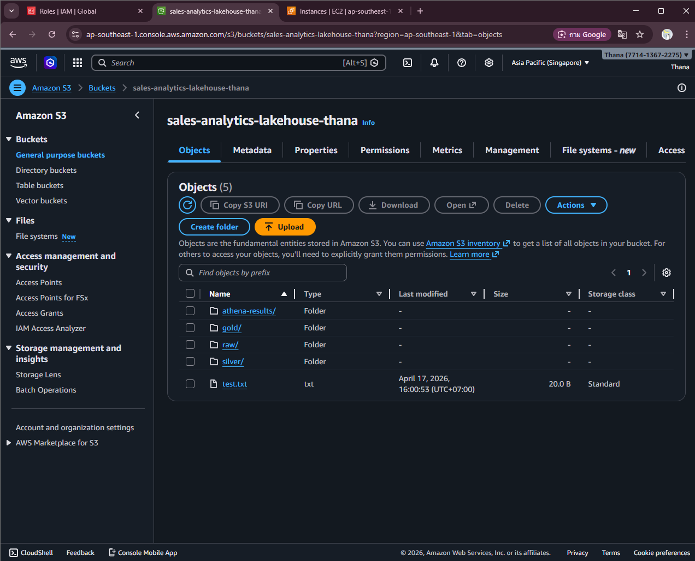
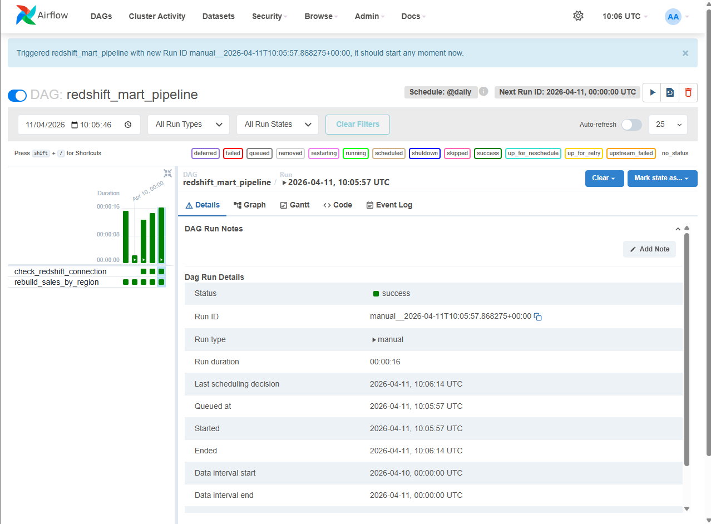
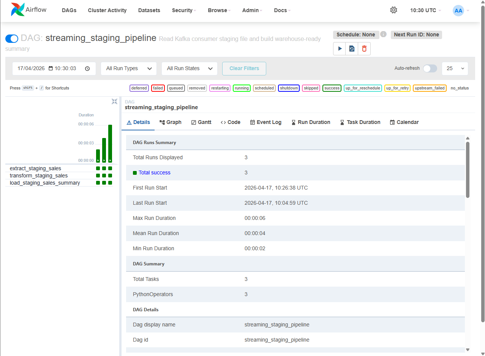
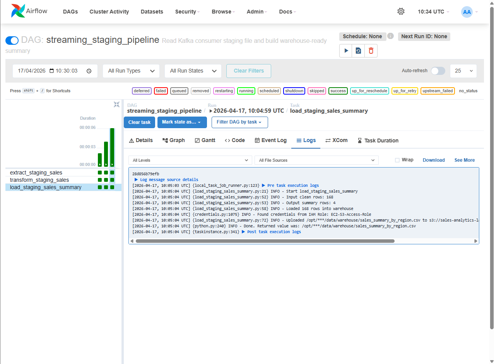
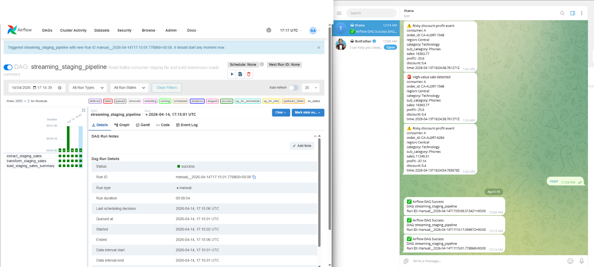
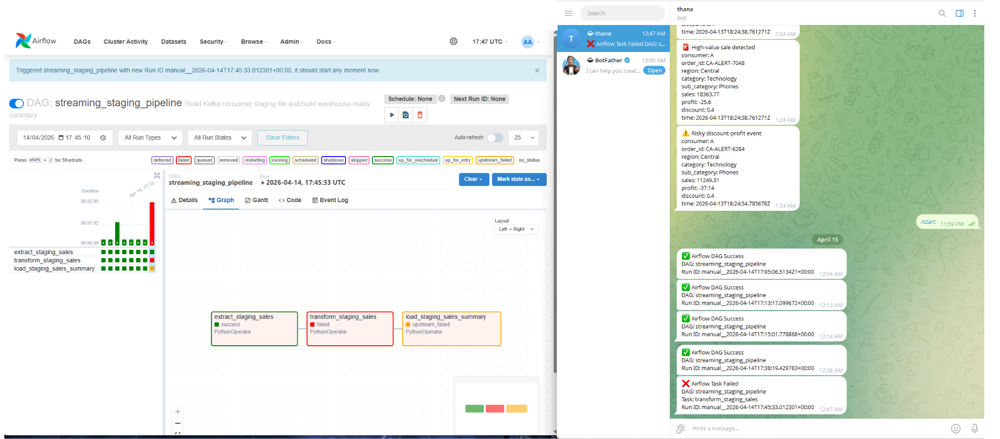

# 🛠 Airflow ETL Orchestration Pipeline


Production-style **batch data pipeline orchestration** using Apache Airflow with cloud storage (S3), Redshift integration, and real-time alerting.

---

# 🚀 Overview

This project demonstrates a **production-like Airflow pipeline** designed to orchestrate ETL workflows on top of a data lake architecture.

## 🔑 Highlights

- End-to-end ETL orchestration using Airflow DAGs
- Medallion architecture (raw → silver → gold)
- Integration with AWS S3 & Redshift
- Fault-tolerant pipeline with retries
- Real-time alerting via Telegram
- Full observability (logs + DAG monitoring)

---

# 🧠 Architecture



```
Kafka (Project 3)
      ↓
S3 (raw)
      ↓
Airflow DAG (Project 4)
      ↓
ETL Processing
      ↓
S3 (silver / gold)
      ↓
Redshift (analytics-ready)
```

---

# 📊 Pipeline Flow

## 1️⃣ Extract

- Reads staging data from local / S3
- Handles encoding issues & schema normalization
- Outputs clean intermediate dataset

---

## 2️⃣ Transform

- Validates timestamps
- Handles null / invalid values
- Aggregates business metrics:
  - Total sales
  - Sales by category
  - Profit insights

---

## 3️⃣ Load

- Writes transformed data to S3 (silver / gold)
- Loads analytics-ready data into Redshift



---

# 🧩 DAG Structure

```
extract_staging_sales
        ↓
transform_staging_sales
        ↓
load_staging_sales_summary
```

---

# ⚙️ Airflow Execution

## ✅ Successful DAG Run



---

## 📜 Logs & Debugging



---

# 🚨 Alerting System (Telegram)

## ✅ Success Alert



## ❌ Failure Alert



---

# 🔁 Reliability & Fault Tolerance

- Retry mechanism for transient failures
- Task-level failure isolation
- Clear observability via logs and UI
- Alerting on both success & failure

---

# ☁️ Data Lake (AWS S3)

```
s3://sales-analytics-lakehouse-thana/

├── raw/
├── silver/
└── gold/
```

---

# 🐳 Running the Project

```bash
docker compose up -d
```

Airflow UI:
http://localhost:8080

---

# 🧠 Key Concepts Demonstrated

- Airflow DAG orchestration
- Medallion architecture
- ETL modular design
- Cloud data lake integration
- Observability & alerting
- Production-style pipeline design

---

# 🏁 Portfolio Context

| Project | Description |
|--------|------------|
| Project 1 | Batch ETL |
| Project 2 | FastAPI Analytics |
| Project 3 | Kafka Streaming |
| Project 4 | Airflow Orchestration |

---

# 💡 Key Takeaway

This project demonstrates how to:

- Build reliable and maintainable ETL pipelines  
- Orchestrate workflows using Airflow  
- Integrate with cloud storage and data warehouses  
- Handle failures with retries and alerting  
- Design systems with production-level observability  
