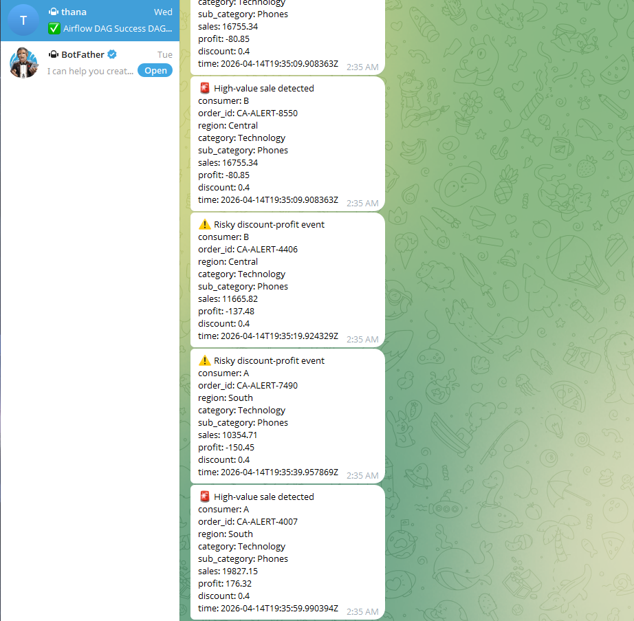

# 🛠 Airflow ETL Orchestration Pipeline

Production-style **batch data pipeline orchestration** using Apache Airflow with cloud storage (S3), Redshift integration, and real-time alerting.

---

# 🚀 Overview

This project demonstrates a **production-like Airflow pipeline** designed to orchestrate ETL workflows on top of a data lake architecture.

## 🔑 Highlights

- End-to-end ETL orchestration using Airflow DAGs
- Medallion architecture (raw → silver → gold)
- Integration with AWS S3 & Redshift
- Fault-tolerant pipeline with retries
- Real-time alerting via Telegram
- Full observability (logs + DAG monitoring)

---

# 🧠 Architecture

Kafka (Project 3)
      ↓
S3 (raw)
      ↓
Airflow DAG (Project 4)
      ↓
ETL Processing
      ↓
S3 (silver / gold)
      ↓
Redshift (analytics-ready)

---

# 📊 Pipeline Flow

## 1️⃣ Extract
- Reads staging data from local / S3
- Handles encoding issues & schema normalization
- Outputs clean intermediate dataset

## 2️⃣ Transform
- Validates timestamps
- Handles null / invalid values
- Aggregates business metrics

## 3️⃣ Load
- Writes transformed data to S3 (silver / gold)
- Loads analytics-ready data into Redshift

---

# ⚙️ Airflow Execution

## ✅ Successful DAG Run

## 📜 Logs & Debugging

---

# 🚨 Alerting System (Telegram)

## ✅ Success Alert

## ❌ Failure Alert

---

# 📊 Business Event Alerts (Streaming)

In addition to Airflow task monitoring, the system also supports **real-time business event alerting** from streaming data.

### 🔥 Example Alerts

### 🔗 Integration Flow
Kafka → Consumer → Rule Detection → Telegram

---

# ☁️ Data Lake (AWS S3)

s3://sales-analytics-lakehouse-thana/
- raw/
- silver/
- gold/

---

# 🐳 Running the Project

docker compose up -d

Airflow UI: http://localhost:8080
