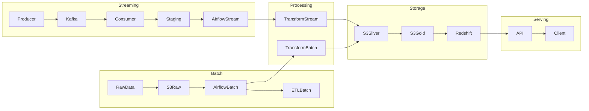
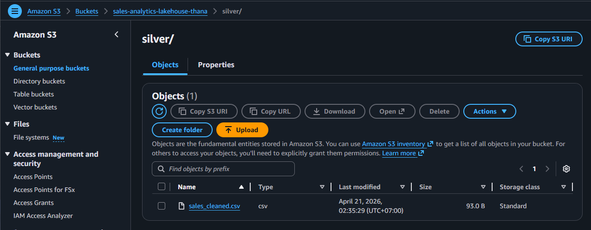

# 🛠 Airflow Data Pipeline Orchestration (Project 4)

Production-style **data pipeline orchestration** using Apache Airflow, integrating streaming data (Kafka) with batch processing and cloud warehouse.

---

# 📸 System Overview

Kafka (Project 3)
      ↓
Staging (JSONL / S3)
      ↓
Airflow DAG (Project 4)
      ↓
ETL (Deduplication + Transform)
      ↓
S3 (silver / gold)
      ↓
Redshift (analytics-ready)

---

# 🏗 Architecture Overview

> This architecture integrates both batch and streaming pipelines.
> 
> - Batch pipeline handles historical data ingestion into S3
> - Batch and streaming data are unified at the transformation layer before loading into warehouse
> - Streaming pipeline processes real-time events via Kafka
> - Airflow orchestrates both pipelines and enables downstream data consistency
> - Final outputs are stored in Redshift for analytics and serving

---

# 🔥 Key Idea

- Project 3 (Kafka) → At-least-once delivery (no data loss, duplicates allowed)
- Project 4 (Airflow) → Deduplication + data correctness

---

# ⚙️ Pipeline Flow

## 1️⃣ Extract
- Read staging data from Kafka consumer
- Normalize schema

## 2️⃣ Transform
- Clean invalid values
- Deduplicate events
- Aggregate metrics

## 3️⃣ Load
- Write to S3 (silver / gold)
- Load into Redshift

---

# 🧩 DAG Structure

extract_staging_sales
        ↓
transform_staging_sales
        ↓
load_staging_sales_summary

---

# 🔁 Deduplication Strategy

To support at-least-once delivery from Kafka:

- Duplicates may occur due to offset reprocessing
- Deduplication is handled in Airflow (downstream)

Approach:
- Use event_id as unique key
- Remove duplicates during transformation step

👉 Ensures:
- No data loss (streaming layer)
- Clean data (warehouse layer)

---

# 🛠 Debug & Recovery Strategy

- If Airflow task fails:
  - retry mechanism is configured
  - logs are used to identify failure

- If data inconsistency occurs:
  - verify warehouse output
  - trace back to transformation logic
  - inspect raw data in S3

👉 Supports debugging at each layer (raw → silver → gold)

---

# 📊 Execution Proof

## Airflow DAG Orchestration

## Task Execution Log

## Real-time Alert Detection

---

# 📦 Data Lake Output (S3)

---

# 🧠 What This Project Shows

- Airflow orchestration
- Streaming → Batch integration
- At-least-once architecture
- Deduplication strategy
- Data lake + warehouse pipeline
- Alerting system

---

# 📌 Summary

This project demonstrates:

- End-to-end orchestration using Airflow
- Integration between streaming (Kafka) and batch processing
- Reliable ingestion (at-least-once) with downstream deduplication
- Data lake (S3) and warehouse (Redshift) integration

👉 Designed to reflect real-world data engineering workflow and system reliability trade-offs
